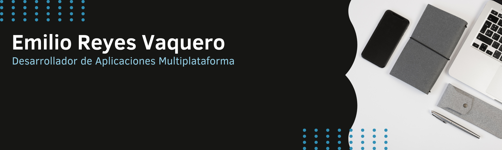

  

<h1 align="center">🚀 Hola, soy Emilio (Revalyx)</h1>

  
  
  

  <b>Técnico Superior en Desarrollo de Aplicaciones Multiplataforma (DAM)</b> 
  Especialista en arquitecturas limpias con <b>Laravel</b> y desarrollo nativo <b>Android/Kotlin</b>.

  

---

### 🛠️ Tecnologías & Stack

**Languages & Core**

  
  
  
  
  

**Frameworks & Frontend**

  
  
  
  

**Tools & Databases**

  
  
  
  
  
  

---

### 📊 Mi Actividad en Tiempo Real

---

### 📂 Proyectos Destacados

> [!IMPORTANT]
> ### 🏆 Sistema de Gestión Integral
> Desarrollo Full Stack enfocado en la optimización de procesos y escalabilidad.
> `Laravel` `MySQL` `Kotlin`
> [Ver Repositorio →](https://github.com/Revalyx)

---

### ⚡ Sobre mí

  

- 🚀 **Enfocado en:** El desarrollo de soluciones escalables, especialmente con **Laravel** para el backend y **Kotlin** para aplicaciones móviles.
- 🎓 **Background:** Técnico Superior en **Desarrollo de Aplicaciones Multiplataforma (DAM)**.
- 🧠 **Filosofía:** Soy un firme creyente de que *"el código se lee más veces de las que se escribe"*, por eso priorizo la limpieza y la mantenibilidad.
- 🛠️ **Actualmente:** Perfeccionando patrones de diseño (MVVM, Clean Architecture) y explorando nuevas formas de optimizar APIs REST. Además, creando videojuegos como proyectos alternativos.
- 💬 **Hablemos de:** Arquitectura de software, el ecosistema Android o por qué PHP sigue siendo una bestia en el desarrollo web moderno.

---
