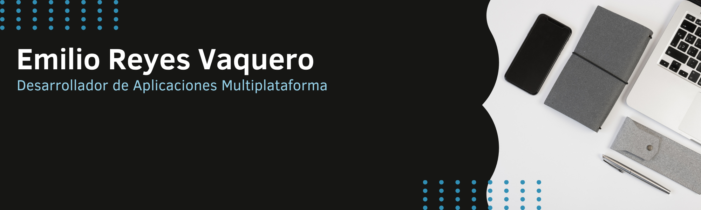

  

<h1 align="center">🚀 Hola, soy Emilio (Revalyx)</h1>

  
  

  <b>Técnico Superior en Desarrollo de Aplicaciones Multiplataforma (DAM) & Especialista en Ciberseguridad</b> 
  Construyendo aplicaciones seguras con <b>Kotlin/Android</b>, <b>Node.js/TypeScript</b> y arquitectura <b>Full-Stack</b>.

  
  &nbsp;&nbsp;
  

  

---

### 🛠️ Tecnologías y Stack

**Mobile & Frontend**

  
  
  
  

**Backend, Database & DevOps**

  
  
  
  

**Game Dev & Legacy**

  
  
  

---

### 📂 Proyectos

> [!NOTE]
> ### 📱 Apps Móviles & Seguridad (Android)
> Desarrollo nativo con enfoque en criptografía local, almacenamiento seguro y biometría.
> [Ver mis repositorios →](https://github.com/Revalyx)

> [!NOTE]
> ### ⚙️ APIs Hardened & Backend
> Arquitecturas backend robustas en Node.js/TypeScript orientadas a la mitigación de vulnerabilidades OWASP Top 10.
> [Ver mis repositorios →](https://github.com/Revalyx)

---

### ⚡ Enfoque y Mentalidad

- 🚀 **En qué estoy:** Diseñando ecosistemas full-stack seguros, conectando clientes móviles nativos (Kotlin) con backends eficientes en contenedores Docker sobre Linux.
- 🎓 **Formación:** Técnico Superior en **DAM** con especialización en **Ciberseguridad**.
- 🧠 **Mentalidad:** Programación defensiva desde la línea cero, código limpio y arquitectura orientada al rendimiento y la estabilidad en producción.
- 💬 **Hablemos de:** Desarrollo multiplataforma, seguridad aplicada a APIs o patrones de arquitectura limpia.

---

### 📊 Actividad en GitHub

  

